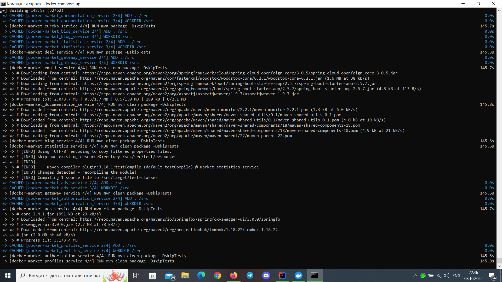

# Сборка всех контейнеров с микросервисами

### Устанавливаем Docker Desktop https://www.docker.com/products/docker-desktop/

### Открываем командную строку

### Выполняем следующую последовательность команд

<pre>
cd абсолютный_путь_до_файла_docker-compose.yaml
docker-compose up
</pre> 

### Ждём когда Docker поднимет контейнеры

### Вот так выглядит результат

### После запуска контейнеров

1. Мы можем перейти к управлению БД:  
   1.1. Postgre - http://localhost:80  
   1.2. Mongo - http://localhost:81
2. Использовать Swagger:  
   2.1. Конкретный сервис - http://localhost:порт_сервиса  
   2.2. Общий Swagger - http://loclahost:8888  