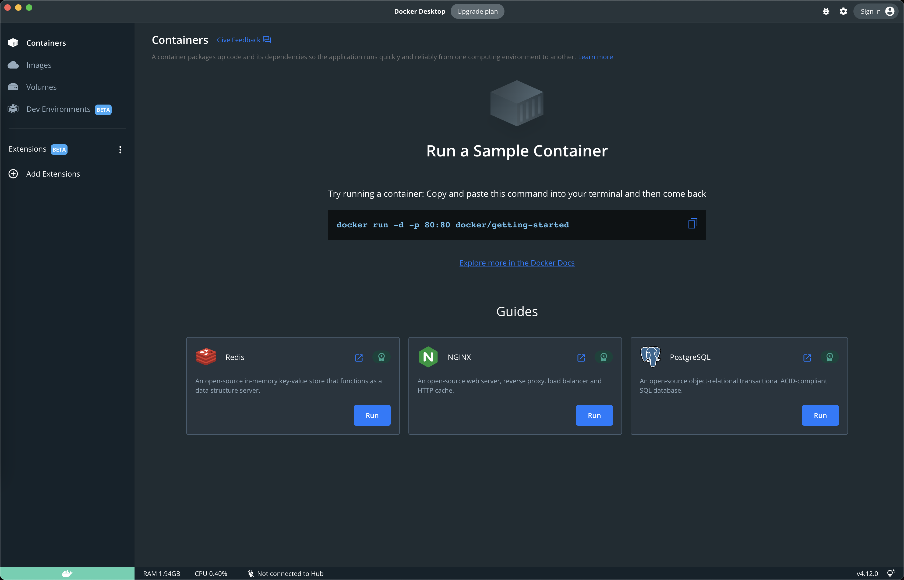
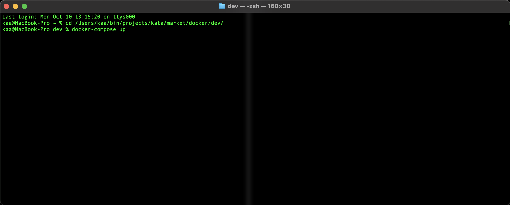
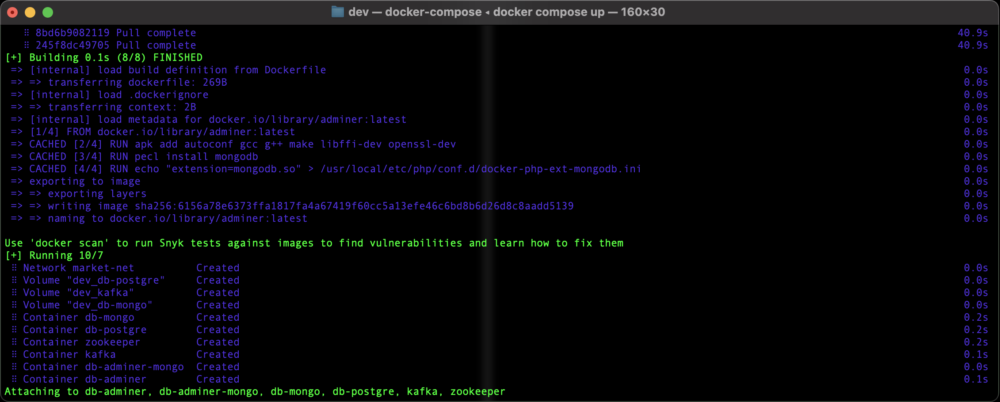
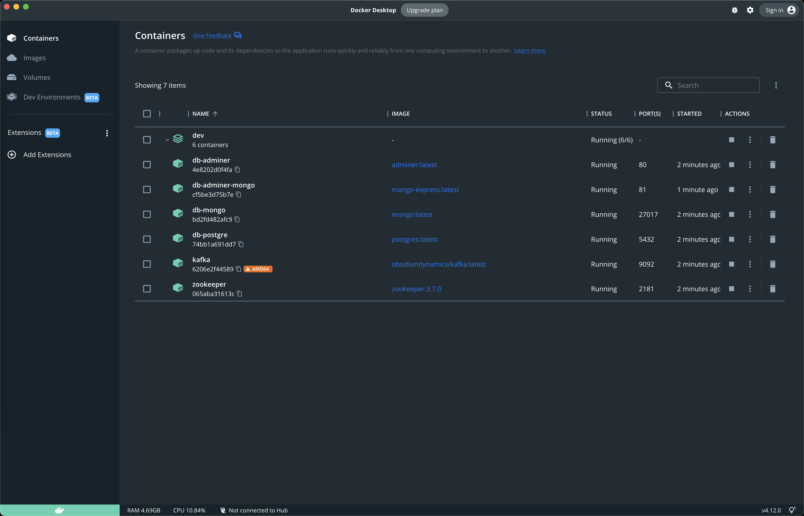
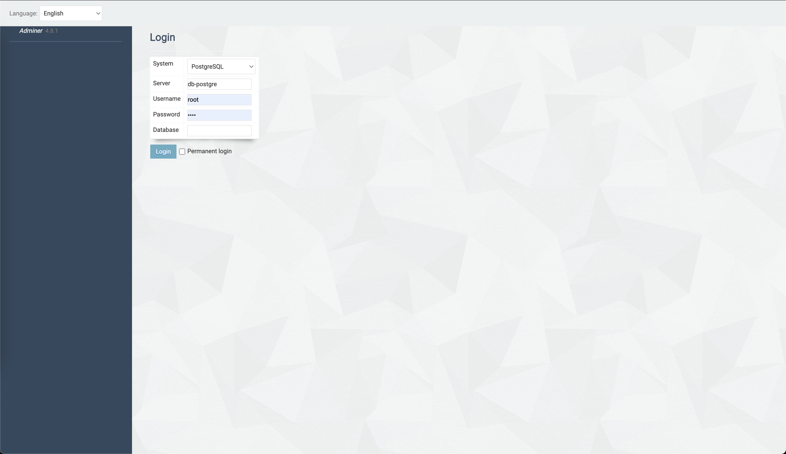
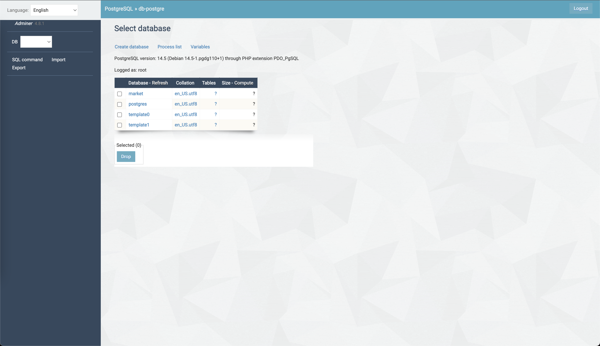
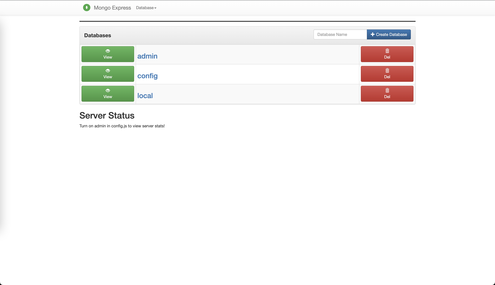

# Сборка окружения разработчика  

##1. Установка Docker-desktop  
Скачать можно по адресу: https://www.docker.com/products/docker-desktop/   
Процесс установки зависит от системы, по этому заострять внимание на этом не будем. Здесь и далее, все примеры и скриншоты взяты из MacOS, но в целом будут походить на вашу систему.  

##2. Вид Docker-desktop после установки  

  

##3. Установка необходимых контейнеров  
3.1. Запускаем терминал (консоль)  
3.2. Выполняем последовательность комманд:  
<pre>
cd /Users/kaa/bin/projects/market/docker/dev/
docker-compose up
</pre>
где, <strong>/Users/kaa/bin/projects/market/docker/dev/</strong> путь к папке с файлом docker-compose.yaml (может отличатся в зависимости от системы)  

  

3.3. Ожидаем сборки и запуска всех контейнеров  

  

3.4. Возвращаемся в Docker-desktop  

##4. Вид Docker-desktop после установки необходимых контейнеров  

Контейнерами можно управлять вручную  

  

##5. Управление БД

5.1. Postgre  
если контейнеры db-adminer и db-postgre активны  
то переходим по адресу: http://localhost:80/  
тип сервера: PostgreSQL  
сервер: db-postgre  
логин и пароль: root  
(для mongo аналогично, но работает только просмотр данных)  

  

  

5.2. Mongo  
если контейнеры db-adminer-mongo и db-mongo активны  
то переходим по адресу: http://localhost:81/  

